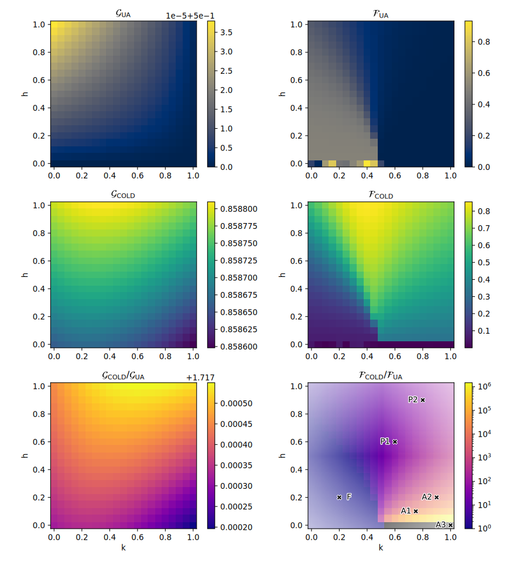
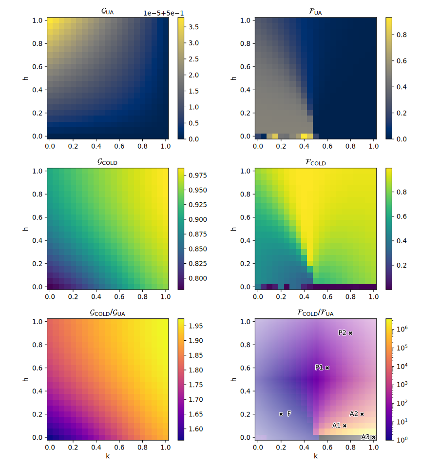

# Counterdiabatic optimized driving in quantum phase sensitive models

Extra resources for the poster presented at the Quantum Error Correction | Mitigation Workshop workshop in Trento, October 2023.

## general definitions

$$\varepsilon_x = \frac{\bra{\psi(\tau)}H(\tau)\ket{\psi(\tau)}_x - E_{min}}{E_{max} - E_{min}}$$

$$\mathcal{G}_x = 1 - \varepsilon_x$$

## ANNNI model annealing

We prepare the ANNNI model
$$H_f^{\text{(ANNNI)}} = -J^*\sum_i \sigma^x_i \sigma^x_{i+1} + k\sum_i \sigma^x_i \sigma^x_{i+2} + h\sum_i \sigma^z_i$$
with fixed $J^*=1$, chinging the $h$ and $k$ to test different phases of the final ground state.

### local ansatz

Let us start from a simple AGP ansatz:
$$\mathcal{A}_{\text{local}} = \alpha_1\sum_i\sigma_i^y$$

  

| name |     F |     P1 |     P2 |       A1 |       A2 |       A3 |
| --- | --- | --- | --- | --- | --- | --- |
|$\varepsilon_{UA}$|   0.5 |    0.5 |    0.5 |      0.5 |      0.5 |      0.5 |
|$\mathcal{F}_{UA}$|  0.49 | 0.0177 | 0.0109 | 2.06e-05 | 7.93e-05 | 3.08e-33 |
|$\varepsilon_{LCD}$| 0.423 |  0.316 |  0.269 |    0.468 |    0.441 |      0.5 |
|$\mathcal{F}_{lcd}$| 0.495 |  0.142 |  0.221 |  0.00015 |  0.00113 | 3.08e-33 |
|$\varepsilon_{COLD}$| 0.141 |  0.141 |  0.141 |    0.141 |    0.141 |    0.141 |
|$\mathcal{F}_{COLD}$| 0.121 |  0.689 |  0.721 |    0.363 |      0.4 |  2.7e-05 |
|$\mathcal{G}_{COLD}$  | 0.859 |  0.859 |  0.859 |    0.859 |    0.859 |    0.859 |
|$\mathcal{G}_{UA}$    |   0.5 |    0.5 |    0.5 |      0.5 |      0.5 |      0.5 |

### 'nearest' ansatz

Let us make the AGP ansatz a little bit more complicated.

$$    \mathcal{A}_{near} = \alpha_1\sum_i\sigma_i^y + \alpha_2\sum_i\left( \sigma_i^x\sigma_{i+1}^y + \sigma_i^y\sigma_{i+1}^x \right) + \alpha_3\sum_i\left( \sigma_i^y\sigma_{i+1}^z + \sigma_i^z\sigma_{i+1}^y \right) $$

We see an increase fidelity of the prepared state with COLD across all the points.

| name |     F |     P1 |     P2 |       A1 |       A2 |       A3 |
| --- | --- | --- | --- | --- | --- | --- |
|$\varepsilon_{UA}$|   0.5 |    0.5 |    0.5 |      0.5 |      0.5 |      0.5 |
|$\mathcal{F}_{UA}$|  0.49 | 0.0177 | 0.0109 | 2.06e-05 | 7.93e-05 | 3.08e-33 |
|$\varepsilon_{LCD}$| 0.461 |  0.373 |  0.315 |    0.483 |    0.467 |      0.5 |
|$\mathcal{F}_{LCD}$|   0.5 |  0.115 |  0.183 | 9.07e-05 | 0.000631 | 3.08e-33 |
|$\varepsilon_{COLD}$| 0.174 |  0.111 | 0.0938 |    0.164 |    0.142 |    0.159 |
|$\mathcal{F}_{COLD}$| 0.523 |  0.782 |  0.785 |    0.455 |    0.485 |  3.2e-05 |
|$\mathcal{G}_{COLD}$| 0.826 |  0.889 |  0.906 |    0.836 |    0.858 |    0.841 |
|$\mathcal{G}_{UA}$|   0.5 |    0.5 |    0.5 |      0.5 |      0.5 |      0.5 |

### 'next' ansatz

$$\mathcal{A}_{next} = \alpha_1\sum_i\sigma_i^y \nonumber + \alpha_2\sum_i\left( \sigma_i^x\sigma_{i+1}^y + \sigma_i^y\sigma_{i+1}^x \right) + \alpha_3\sum_i\left( \sigma_i^y\sigma_{i+1}^z + \sigma_i^z\sigma_{i+1}^y \right) + \alpha_4\sum_i\left( \sigma_i^x\sigma_{i+2}^y + \sigma_i^y\sigma_{i+2}^x \right) + \alpha_5\sum_i\left( \sigma_i^y\sigma_{i+2}^z + \sigma_i^z\sigma_{i+2}^y \right)$$

  

|name |     F |     P1 |     P2 |       A1 |       A2 |       A3 |
| --- | --- | --- | --- | --- | --- | --- |
|$\varepsilon_{UA}$|   0.5 |    0.5 |    0.5 |      0.5 |      0.5 |      0.5 |
|$\mathcal{F}_{UA}$|  0.49 | 0.0177 | 0.0109 | 2.06e-05 | 7.93e-05 | 3.08e-33 |
|$\varepsilon_{LCD}$| 0.449 |  0.271 |  0.165 |    0.459 |    0.415 |      0.5 |
|$\mathcal{F}_{LCD}$|   0.5 |   0.27 |  0.503 | 0.000382 |   0.0043 | 3.08e-33 |
|$\varepsilon_{COLD}$| 0.148 | 0.0467 |  0.023 |   0.0721 |   0.0435 |   0.0489 |
|$\mathcal{F}_{COLD}$| 0.436 |  0.938 |  0.961 |    0.775 |     0.85 | 0.000148 |
|$\mathcal{G}_{COLD}$  | 0.852 |  0.953 |  0.977 |    0.928 |    0.957 |    0.951 |
|$\mathcal{G}_{UA}$    |   0.5 |    0.5 |    0.5 |      0.5 |      0.5 |      0.5 |
